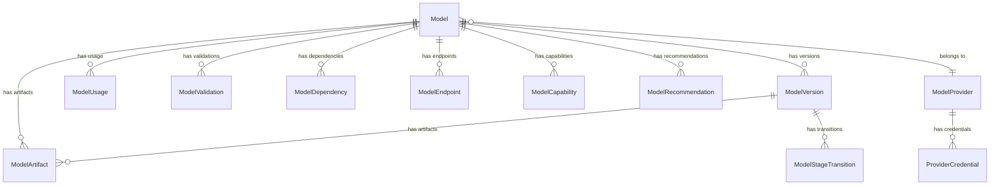

# 🔧 DOCUMENTACIÓN TÉCNICA - MÓDULO MODELOS

**Fecha:** Octubre 2025  
**Versión:** 1.0  
**Propósito:** Documentación técnica completa de entidades JPA, vistas, funciones y procedimientos del módulo de modelos

---

## 🎯 RESUMEN EJECUTIVO

El módulo de **modelos** utiliza **14 entidades JPA principales** generadas automáticamente por el framework Enart, con **2 vistas optimizadas**, **2 funciones SQL** y **1 procedimiento SQL**, diseñadas para soportar el gobierno completo de modelos de IA con **trazabilidad**, **versionado** y **compliance**.

### **Arquitectura de Datos:**
- **Entidades principales:** 14 entidades con relaciones complejas
- **Vistas optimizadas:** 2 vistas para consultas frecuentes
- **Funciones SQL:** 2 funciones para cálculos especializados
- **Procedimientos SQL:** 1 procedimiento para operaciones complejas

---

## 📊 ENTIDADES JPA PRINCIPALES

### **1. Model (Entidad Principal)**

#### **Tabla:** `MDLMODELS`
#### **Propósito:** Entidad principal que representa un modelo de IA

```java
@Entity
@Table(name = "MDLMODELS")
public class Model {
    @Id
    @GeneratedValue(strategy = GenerationType.IDENTITY)
    private Long idxmodel;
    
    // Información básica
    private String mdlname;                    // Nombre del modelo
    private String mdldescription;            // Descripción
    private String mdltype;                   // Tipo: CLASSIFICATION, REGRESSION, NLP, etc.
    private String mdlcategory;               // Categoría: VISION, TEXT, AUDIO, etc.
    private String mdlframework;              // Framework: TENSORFLOW, PYTORCH, etc.
    private String mdlversion;                // Versión actual
    private String mdlstatus;                 // Estado: DRAFT, TRAINING, EVALUATED, APPROVED, PRODUCTION, DEPRECATED
    
    // Metadatos técnicos
    private String mdlarchitecture;           // Arquitectura del modelo
    private String mdlparameters;             // Parámetros en JSON
    private String mdlhyperparameters;       // Hiperparámetros en JSON
    private String mdlmetrics;                // Métricas en JSON
    private String mdlperformance;            // Rendimiento en JSON
    
    // Información de despliegue
    private String mdlendpoint;               // Endpoint de API
    private String mdlcontainer;              // Container/Docker image
    private String mdlresources;              // Recursos requeridos en JSON
    
    // Compliance y governance
    private String mdlcompliance;             // Estado de compliance
    private String mdlbias;                   // Análisis de sesgo
    private String mdltransparency;           // Transparencia
    private String mdlinterpretability;       // Interpretabilidad
    
    // Auditoría
    private String mdlcreatedby;              // Usuario creador
    private LocalDateTime mdlcreatedat;      // Fecha de creación
    private String mdlupdatedby;              // Usuario actualizador
    private LocalDateTime mdlupdatedat;      // Fecha de actualización
    private String mdlapprovedby;             // Usuario aprobador
    private LocalDateTime mdlapprovedat;      // Fecha de aprobación
    
    // Relaciones
    @OneToMany(mappedBy = "model", cascade = CascadeType.ALL)
    private List<ModelVersion> versions;
    
    @OneToMany(mappedBy = "model", cascade = CascadeType.ALL)
    private List<ModelArtifact> artifacts;
    
    @OneToMany(mappedBy = "model", cascade = CascadeType.ALL)
    private List<ModelUsage> usage;
    
    @OneToMany(mappedBy = "model", cascade = CascadeType.ALL)
    private List<ModelValidation> validations;
    
    @ManyToOne
    @JoinColumn(name = "idxmodelprovider")
    private ModelProvider provider;
    
    @OneToMany(mappedBy = "model", cascade = CascadeType.ALL)
    private List<ModelDependency> dependencies;
}
```

### **2. ModelVersion**

#### **Tabla:** `MDLMODELVERSIONS`
#### **Propósito:** Control de versiones del modelo

```java
@Entity
@Table(name = "MDLMODELVERSIONS")
public class ModelVersion {
    @Id
    @GeneratedValue(strategy = GenerationType.IDENTITY)
    private Long idxmodelversion;
    
    @ManyToOne
    @JoinColumn(name = "idxmodel")
    private Model model;
    
    // Información de versión
    private String mdlversion;                // Número de versión (ej: 1.2.0)
    private String mdlversiondescription;     // Descripción de cambios
    private String mdlversionstatus;          // Estado: DRAFT, TRAINING, EVALUATED, APPROVED, PRODUCTION
    
    // Metadatos técnicos
    private String mdlversionmetrics;         // Métricas específicas de esta versión
    private String mdlversionperformance;     // Rendimiento específico
    private String mdlversionchanges;         // Cambios realizados
    
    // Archivos y artefactos
    private String mdlversionfile;            // Archivo del modelo
    private String mdlversionchecksum;       // Checksum del archivo
    private String mdlversionpath;            // Ruta del archivo
    
    // Auditoría
    private String mdlversioncreatedby;       // Usuario creador
    private LocalDateTime mdlversioncreatedat; // Fecha de creación
    private String mdlversionupdatedby;       // Usuario actualizador
    private LocalDateTime mdlversionupdatedat; // Fecha de actualización
    
    // Relaciones
    @OneToMany(mappedBy = "modelVersion", cascade = CascadeType.ALL)
    private List<ModelArtifact> artifacts;
    
    @OneToMany(mappedBy = "modelVersion", cascade = CascadeType.ALL)
    private List<ModelStageTransition> transitions;
}
```

### **3. ModelProvider**

#### **Tabla:** `MDLMODELPROVIDERS`
#### **Propósito:** Proveedores de modelos (Hugging Face, OpenAI, etc.)

```java
@Entity
@Table(name = "MDLMODELPROVIDERS")
public class ModelProvider {
    @Id
    @GeneratedValue(strategy = GenerationType.IDENTITY)
    private Long idxmodelprovider;
    
    // Información del proveedor
    private String mdlprovidername;           // Nombre del proveedor
    private String mdlproviderdescription;    // Descripción
    private String mdlprovidertype;           // Tipo: HUGGINGFACE, OPENAI, CUSTOM, etc.
    private String mdlproviderurl;            // URL del proveedor
    private String mdlproviderapi;            // API endpoint
    
    // Configuración
    private String mdlproviderconfig;         // Configuración en JSON
    private String mdlprovidercredentials;    // Credenciales (encriptadas)
    private String mdlproviderlimits;          // Límites de uso
    
    // Estado
    private String mdlproviderstatus;         // Estado: ACTIVE, INACTIVE, SUSPENDED
    private Boolean mdlproviderverified;      // Verificado
    
    // Auditoría
    private String mdlprovidercreatedby;      // Usuario creador
    private LocalDateTime mdlprovidercreatedat; // Fecha de creación
    private String mdlproviderupdatedby;      // Usuario actualizador
    private LocalDateTime mdlproviderupdatedat; // Fecha de actualización
    
    // Relaciones
    @OneToMany(mappedBy = "provider", cascade = CascadeType.ALL)
    private List<Model> models;
    
    @OneToMany(mappedBy = "provider", cascade = CascadeType.ALL)
    private List<ProviderCredential> credentials;
}
```

### **4. ModelArtifact**

#### **Tabla:** `MDLMODELARTIFACTS`
#### **Propósito:** Artefactos asociados al modelo (archivos, configuraciones, etc.)

```java
@Entity
@Table(name = "MDLMODELARTIFACTS")
public class ModelArtifact {
    @Id
    @GeneratedValue(strategy = GenerationType.IDENTITY)
    private Long idxmodelartifact;
    
    @ManyToOne
    @JoinColumn(name = "idxmodel")
    private Model model;
    
    @ManyToOne
    @JoinColumn(name = "idxmodelversion")
    private ModelVersion modelVersion;
    
    // Información del artefacto
    private String mdlartifactname;           // Nombre del artefacto
    private String mdlartifactdescription;    // Descripción
    private String mdlartifacttype;           // Tipo: MODEL_FILE, CONFIG, DATASET, LOG, etc.
    private String mdlartifactformat;         // Formato: PICKLE, ONNX, TORCH, JSON, etc.
    
    // Archivo
    private String mdlartifactfile;           // Archivo
    private String mdlartifactpath;           // Ruta del archivo
    private String mdlartifactchecksum;       // Checksum
    private Long mdlartifactsize;             // Tamaño en bytes
    
    // Metadatos
    private String mdlartifactmetadata;       // Metadatos en JSON
    private String mdlartifacttags;           // Tags separados por comas
    
    // Auditoría
    private String mdlartifactcreatedby;      // Usuario creador
    private LocalDateTime mdlartifactcreatedat; // Fecha de creación
    private String mdlartifactupdatedby;      // Usuario actualizador
    private LocalDateTime mdlartifactupdatedat; // Fecha de actualización
}
```

### **5. ModelUsage**

#### **Tabla:** `MDLMODELUSAGE`
#### **Propósito:** Registro de uso del modelo

```java
@Entity
@Table(name = "MDLMODELUSAGE")
public class ModelUsage {
    @Id
    @GeneratedValue(strategy = GenerationType.IDENTITY)
    private Long idxmodelusage;
    
    @ManyToOne
    @JoinColumn(name = "idxmodel")
    private Model model;
    
    // Información de uso
    private String mdlusageuser;              // Usuario que usa el modelo
    private String mdlusageendpoint;          // Endpoint utilizado
    private String mdlusagerequest;           // Request en JSON
    private String mdlusageresponse;          // Response en JSON
    
    // Métricas
    private Long mdlusagelatency;             // Latencia en ms
    private String mdlusageinputtokens;       // Tokens de entrada
    private String mdlusageoutputtokens;      // Tokens de salida
    private String mdlusagecost;              // Costo de la operación
    
    // Resultado
    private String mdlusageresult;            // Resultado: SUCCESS, ERROR, TIMEOUT
    private String mdlusageerror;              // Error si aplica
    private String mdlusageconfidence;         // Confianza del resultado
    
    // Auditoría
    private LocalDateTime mdlusagecreatedat;  // Fecha de uso
    private String mdlusageip;                // IP del usuario
    private String mdlusageuseragent;         // User agent
}
```

### **6. ModelValidation**

#### **Tabla:** `MDLMODELVALIDATIONS`
#### **Propósito:** Resultados de validaciones del modelo

```java
@Entity
@Table(name = "MDLMODELVALIDATIONS")
public class ModelValidation {
    @Id
    @GeneratedValue(strategy = GenerationType.IDENTITY)
    private Long idxmodelvalidation;
    
    @ManyToOne
    @JoinColumn(name = "idxmodel")
    private Model model;
    
    // Información de validación
    private String mdlvalidationtype;         // Tipo: PERFORMANCE, BIAS, COMPLIANCE, SECURITY
    private String mdlvalidationstatus;       // Estado: PENDING, RUNNING, COMPLETED, FAILED
    private String mdlvalidationresult;       // Resultado: PASS, FAIL, WARNING
    
    // Métricas
    private Double mdlvalidationscore;        // Score de validación (0-100)
    private String mdlvalidationmetrics;      // Métricas en JSON
    private String mdlvalidationdetails;      // Detalles en JSON
    
    // Issues encontrados
    private String mdlvalidationissues;       // Issues encontrados en JSON
    private String mdlvalidationrecommendations; // Recomendaciones en JSON
    
    // Auditoría
    private String mdlvalidationcreatedby;    // Usuario creador
    private LocalDateTime mdlvalidationcreatedat; // Fecha de creación
    private String mdlvalidationupdatedby;    // Usuario actualizador
    private LocalDateTime mdlvalidationupdatedat; // Fecha de actualización
}
```

### **7. ModelDependency**

#### **Tabla:** `MDLMODELDEPENDENCIES`
#### **Propósito:** Dependencias del modelo

```java
@Entity
@Table(name = "MDLMODELDEPENDENCIES")
public class ModelDependency {
    @Id
    @GeneratedValue(strategy = GenerationType.IDENTITY)
    private Long idxmodeldependency;
    
    @ManyToOne
    @JoinColumn(name = "idxmodel")
    private Model model;
    
    // Información de dependencia
    private String mdldependencyname;         // Nombre de la dependencia
    private String mdldependencytype;         // Tipo: LIBRARY, MODEL, DATASET, SERVICE
    private String mdldependencyversion;      // Versión requerida
    private String mdldependencydescription;  // Descripción
    
    // Configuración
    private String mdldependencyconfig;       // Configuración en JSON
    private String mdldependencyconstraints;  // Restricciones
    
    // Estado
    private String mdldependencystatus;       // Estado: ACTIVE, DEPRECATED, UNAVAILABLE
    private Boolean mdldependencyrequired;    // Requerida
    
    // Auditoría
    private String mdldependencycreatedby;    // Usuario creador
    private LocalDateTime mdldependencycreatedat; // Fecha de creación
    private String mdldependencyupdatedby;    // Usuario actualizador
    private LocalDateTime mdldependencyupdatedat; // Fecha de actualización
}
```

### **8. ModelEndpoint**

#### **Tabla:** `MDLMODELENDPOINTS`
#### **Propósito:** Endpoints de API del modelo

```java
@Entity
@Table(name = "MDLMODELENDPOINTS")
public class ModelEndpoint {
    @Id
    @GeneratedValue(strategy = GenerationType.IDENTITY)
    private Long idxmodelendpoint;
    
    @ManyToOne
    @JoinColumn(name = "idxmodel")
    private Model model;
    
    // Información del endpoint
    private String mdlendpointname;           // Nombre del endpoint
    private String mdlendpointurl;            // URL del endpoint
    private String mdlendpointmethod;         // Método HTTP: GET, POST, PUT, DELETE
    private String mdlendpointdescription;     // Descripción
    
    // Configuración
    private String mdlendpointconfig;         // Configuración en JSON
    private String mdlendpointheaders;        // Headers en JSON
    private String mdlendpointparameters;     // Parámetros en JSON
    
    // Autenticación
    private String mdlendpointauth;            // Tipo de autenticación
    private String mdlendpointcredentials;    // Credenciales (encriptadas)
    
    // Estado
    private String mdlendpointstatus;          // Estado: ACTIVE, INACTIVE, MAINTENANCE
    private Boolean mdlendpointmonitored;     // Monitoreado
    
    // Auditoría
    private String mdlendpointcreatedby;       // Usuario creador
    private LocalDateTime mdlendpointcreatedat; // Fecha de creación
    private String mdlendpointupdatedby;       // Usuario actualizador
    private LocalDateTime mdlendpointupdatedat; // Fecha de actualización
}
```

### **9. ModelComparison**

#### **Tabla:** `MDLMODELCOMPARISONS`
#### **Propósito:** Comparaciones entre modelos

```java
@Entity
@Table(name = "MDLMODELCOMPARISONS")
public class ModelComparison {
    @Id
    @GeneratedValue(strategy = GenerationType.IDENTITY)
    private Long idxmodelcomparison;
    
    // Modelos comparados
    private Long idxmodel1;                   // ID del primer modelo
    private Long idxmodel2;                   // ID del segundo modelo
    
    // Información de comparación
    private String mdlcomparisonname;         // Nombre de la comparación
    private String mdlcomparisondescription; // Descripción
    private String mdlcomparisoncriteria;     // Criterios de comparación
    
    // Resultados
    private String mdlcomparisonresults;      // Resultados en JSON
    private String mdlcomparisonmetrics;      // Métricas comparadas
    private String mdlcomparisonwinner;       // Modelo ganador
    
    // Auditoría
    private String mdlcomparisoncreatedby;    // Usuario creador
    private LocalDateTime mdlcomparisoncreatedat; // Fecha de creación
    private String mdlcomparisonupdatedby;    // Usuario actualizador
    private LocalDateTime mdlcomparisonupdatedat; // Fecha de actualización
}
```

### **10. ModelCatalog**

#### **Tabla:** `MDLMODELCATALOGS`
#### **Propósito:** Catálogo de modelos disponibles

```java
@Entity
@Table(name = "MDLMODELCATALOGS")
public class ModelCatalog {
    @Id
    @GeneratedValue(strategy = GenerationType.IDENTITY)
    private Long idxmodelcatalog;
    
    // Información del catálogo
    private String mdlcatalogname;             // Nombre del catálogo
    private String mdlcatalogdescription;      // Descripción
    private String mdlcatalogtype;             // Tipo: INTERNAL, EXTERNAL, MARKETPLACE
    private String mdlcatalogurl;              // URL del catálogo
    
    // Configuración
    private String mdlcatalogconfig;           // Configuración en JSON
    private String mdlcatalogcredentials;      // Credenciales (encriptadas)
    
    // Estado
    private String mdlcatalogstatus;           // Estado: ACTIVE, INACTIVE, SYNCING
    private Boolean mdlcatalogsynced;          // Sincronizado
    
    // Auditoría
    private String mdlcatalogcreatedby;        // Usuario creador
    private LocalDateTime mdlcatalogcreatedat; // Fecha de creación
    private String mdlcatalogupdatedby;        // Usuario actualizador
    private LocalDateTime mdlcatalogupdatedat; // Fecha de actualización
}
```

### **11. ModelCapability**

#### **Tabla:** `MDLMODELCAPABILITIES`
#### **Propósito:** Capacidades del modelo

```java
@Entity
@Table(name = "MDLMODELCAPABILITIES")
public class ModelCapability {
    @Id
    @GeneratedValue(strategy = GenerationType.IDENTITY)
    private Long idxmodelcapability;
    
    @ManyToOne
    @JoinColumn(name = "idxmodel")
    private Model model;
    
    // Información de capacidad
    private String mdlcapabilityname;          // Nombre de la capacidad
    private String mdlcapabilitydescription;  // Descripción
    private String mdlcapabilitytype;          // Tipo: CLASSIFICATION, REGRESSION, GENERATION, etc.
    private String mdlcapabilitydomain;        // Dominio: VISION, NLP, AUDIO, etc.
    
    // Configuración
    private String mdlcapabilityconfig;        // Configuración en JSON
    private String mdlcapabilityparameters;   // Parámetros en JSON
    
    // Estado
    private String mdlcapabilitystatus;        // Estado: ACTIVE, INACTIVE, TESTING
    private Boolean mdlcapabilityverified;     // Verificada
    
    // Auditoría
    private String mdlcapabilitycreatedby;     // Usuario creador
    private LocalDateTime mdlcapabilitycreatedat; // Fecha de creación
    private String mdlcapabilityupdatedby;     // Usuario actualizador
    private LocalDateTime mdlcapabilityupdatedat; // Fecha de actualización
}
```

### **12. ModelRecommendation**

#### **Tabla:** `MDLMODELRECOMMENDATIONS`
#### **Propósito:** Recomendaciones de modelos

```java
@Entity
@Table(name = "MDLMODELRECOMMENDATIONS")
public class ModelRecommendation {
    @Id
    @GeneratedValue(strategy = GenerationType.IDENTITY)
    private Long idxmodelrecommendation;
    
    @ManyToOne
    @JoinColumn(name = "idxmodel")
    private Model model;
    
    // Información de recomendación
    private String mdlrecommendationtype;     // Tipo: PERFORMANCE, COST, COMPLIANCE
    private String mdlrecommendationtitle;     // Título
    private String mdlrecommendationdescription; // Descripción
    private String mdlrecommendationpriority; // Prioridad: LOW, MEDIUM, HIGH, CRITICAL
    
    // Detalles
    private String mdlrecommendationdetails;   // Detalles en JSON
    private String mdlrecommendationaction;   // Acción recomendada
    private String mdlrecommendationimpact;   // Impacto esperado
    
    // Estado
    private String mdlrecommendationstatus;    // Estado: PENDING, IN_PROGRESS, COMPLETED, REJECTED
    private String mdlrecommendationassignedto; // Asignado a
    
    // Auditoría
    private String mdlrecommendationcreatedby; // Usuario creador
    private LocalDateTime mdlrecommendationcreatedat; // Fecha de creación
    private String mdlrecommendationupdatedby; // Usuario actualizador
    private LocalDateTime mdlrecommendationupdatedat; // Fecha de actualización
}
```

### **13. ModelStageTransition**

#### **Tabla:** `MDLMODELSTAGETRANSITIONS`
#### **Propósito:** Transiciones entre etapas del modelo

```java
@Entity
@Table(name = "MDLMODELSTAGETRANSITIONS")
public class ModelStageTransition {
    @Id
    @GeneratedValue(strategy = GenerationType.IDENTITY)
    private Long idxmodelstagetransition;
    
    @ManyToOne
    @JoinColumn(name = "idxmodel")
    private Model model;
    
    @ManyToOne
    @JoinColumn(name = "idxmodelversion")
    private ModelVersion modelVersion;
    
    // Información de transición
    private String mdltransitionfromstage;    // Etapa origen
    private String mdltransitiontostage;      // Etapa destino
    private String mdltransitionreason;      // Razón de la transición
    private String mdltransitionstatus;       // Estado: PENDING, APPROVED, REJECTED
    
    // Detalles
    private String mdltransitiondetails;       // Detalles en JSON
    private String mdltransitionconditions;   // Condiciones en JSON
    private String mdltransitionapproval;     // Aprobación en JSON
    
    // Auditoría
    private String mdltransitioncreatedby;    // Usuario creador
    private LocalDateTime mdltransitioncreatedat; // Fecha de creación
    private String mdltransitionupdatedby;    // Usuario actualizador
    private LocalDateTime mdltransitionupdatedat; // Fecha de actualización
}
```

### **14. ProviderCredential**

#### **Tabla:** `MDLPROVIDERCREDENTIALS`
#### **Propósito:** Credenciales de proveedores

```java
@Entity
@Table(name = "MDLPROVIDERCREDENTIALS")
public class ProviderCredential {
    @Id
    @GeneratedValue(strategy = GenerationType.IDENTITY)
    private Long idxprovidercredential;
    
    @ManyToOne
    @JoinColumn(name = "idxmodelprovider")
    private ModelProvider provider;
    
    // Información de credencial
    private String mdlcredentialname;         // Nombre de la credencial
    private String mdlcredentialtype;         // Tipo: API_KEY, OAUTH, BASIC_AUTH
    private String mdlcredentialvalue;        // Valor (encriptado)
    private String mdlcredentialdescription;  // Descripción
    
    // Configuración
    private String mdlcredentialconfig;       // Configuración en JSON
    private String mdlcredentialscope;        // Scope de la credencial
    
    // Estado
    private String mdlcredentialstatus;        // Estado: ACTIVE, INACTIVE, EXPIRED
    private LocalDateTime mdlcredentialexpires; // Fecha de expiración
    
    // Auditoría
    private String mdlcredentialcreatedby;     // Usuario creador
    private LocalDateTime mdlcredentialcreatedat; // Fecha de creación
    private String mdlcredentialupdatedby;     // Usuario actualizador
    private LocalDateTime mdlcredentialupdatedat; // Fecha de actualización
}
```

---

## 📊 VISTAS OPTIMIZADAS

### **1. ModelsOverview**

#### **Propósito:** Vista consolidada de modelos para dashboard principal

```sql
CREATE VIEW models_overview AS
SELECT 
    m.idxmodel,
    m.mdlname,
    m.mdldescription,
    m.mdltype,
    m.mdlcategory,
    m.mdlframework,
    m.mdlversion,
    m.mdlstatus,
    m.mdlperformance,
    m.mdlcompliance,
    m.mdlcreatedby,
    m.mdlcreatedat,
    m.mdlupdatedby,
    m.mdlupdatedat,
    m.mdlapprovedby,
    m.mdlapprovedat,
    mp.mdlprovidername,
    COUNT(mv.idxmodelversion) as version_count,
    COUNT(mu.idxmodelusage) as usage_count,
    AVG(CAST(mu.mdlusagelatency AS DECIMAL)) as avg_latency,
    COUNT(CASE WHEN mv.mdlversionstatus = 'PRODUCTION' THEN 1 END) as production_versions
FROM mdlmodels m
LEFT JOIN mdlmodelproviders mp ON m.idxmodelprovider = mp.idxmodelprovider
LEFT JOIN mdlmodelversions mv ON m.idxmodel = mv.idxmodel
LEFT JOIN mdlmodelusage mu ON m.idxmodel = mu.idxmodel
GROUP BY m.idxmodel, mp.mdlprovidername;
```

### **2. ModelsMetricsSummary**

#### **Propósito:** Resumen de métricas de modelos

```sql
CREATE VIEW models_metrics_summary AS
SELECT 
    m.idxmodel,
    m.mdlname,
    m.mdltype,
    m.mdlstatus,
    COUNT(mu.idxmodelusage) as total_requests,
    COUNT(CASE WHEN mu.mdlusageresult = 'SUCCESS' THEN 1 END) as successful_requests,
    COUNT(CASE WHEN mu.mdlusageresult = 'ERROR' THEN 1 END) as failed_requests,
    AVG(CAST(mu.mdlusagelatency AS DECIMAL)) as avg_latency,
    MAX(CAST(mu.mdlusagelatency AS DECIMAL)) as max_latency,
    MIN(CAST(mu.mdlusagelatency AS DECIMAL)) as min_latency,
    SUM(CAST(mu.mdlusagecost AS DECIMAL)) as total_cost,
    AVG(CAST(mu.mdlusageconfidence AS DECIMAL)) as avg_confidence,
    COUNT(DISTINCT mu.mdlusageuser) as unique_users,
    MAX(mu.mdlusagecreatedat) as last_used
FROM mdlmodels m
LEFT JOIN mdlmodelusage mu ON m.idxmodel = mu.idxmodel
WHERE mu.mdlusagecreatedat >= CURRENT_DATE - INTERVAL '30 days'
GROUP BY m.idxmodel, m.mdlname, m.mdltype, m.mdlstatus;
```

---

## ⚙️ FUNCIONES SQL

### **1. ValidateModel**

#### **Propósito:** Validar un modelo contra criterios específicos

```sql
CREATE OR REPLACE FUNCTION validate_model(
    p_model_id BIGINT,
    p_validation_type VARCHAR(50),
    p_criteria JSONB
) RETURNS JSONB AS $$
DECLARE
    v_result JSONB;
    v_model_record RECORD;
    v_validation_score DECIMAL;
    v_issues JSONB := '[]'::JSONB;
    v_recommendations JSONB := '[]'::JSONB;
BEGIN
    -- Obtener información del modelo
    SELECT * INTO v_model_record
    FROM mdlmodels
    WHERE idxmodel = p_model_id;
    
    IF NOT FOUND THEN
        RETURN jsonb_build_object(
            'valid', false,
            'error', 'Model not found',
            'score', 0
        );
    END IF;
    
    -- Validación según tipo
    CASE p_validation_type
        WHEN 'PERFORMANCE' THEN
            -- Validar rendimiento
            SELECT validate_performance(v_model_record, p_criteria)
            INTO v_result;
            
        WHEN 'BIAS' THEN
            -- Validar sesgo
            SELECT validate_bias(v_model_record, p_criteria)
            INTO v_result;
            
        WHEN 'COMPLIANCE' THEN
            -- Validar compliance
            SELECT validate_compliance(v_model_record, p_criteria)
            INTO v_result;
            
        WHEN 'SECURITY' THEN
            -- Validar seguridad
            SELECT validate_security(v_model_record, p_criteria)
            INTO v_result;
            
        ELSE
            RETURN jsonb_build_object(
                'valid', false,
                'error', 'Invalid validation type',
                'score', 0
            );
    END CASE;
    
    -- Insertar resultado de validación
    INSERT INTO mdlmodelvalidations (
        idxmodel,
        mdlvalidationtype,
        mdlvalidationstatus,
        mdlvalidationresult,
        mdlvalidationscore,
        mdlvalidationmetrics,
        mdlvalidationdetails,
        mdlvalidationissues,
        mdlvalidationrecommendations,
        mdlvalidationcreatedby,
        mdlvalidationcreatedat
    ) VALUES (
        p_model_id,
        p_validation_type,
        'COMPLETED',
        CASE WHEN (v_result->>'valid')::BOOLEAN THEN 'PASS' ELSE 'FAIL' END,
        (v_result->>'score')::DECIMAL,
        v_result,
        p_criteria,
        v_result->'issues',
        v_result->'recommendations',
        'system',
        CURRENT_TIMESTAMP
    );
    
    RETURN v_result;
END;
$$ LANGUAGE plpgsql;
```

### **2. CalculateDrift**

#### **Propósito:** Calcular drift del modelo

```sql
CREATE OR REPLACE FUNCTION calculate_drift(
    p_model_id BIGINT,
    p_time_window INTERVAL DEFAULT '7 days'
) RETURNS JSONB AS $$
DECLARE
    v_result JSONB;
    v_model_record RECORD;
    v_baseline_metrics JSONB;
    v_current_metrics JSONB;
    v_drift_score DECIMAL;
    v_drift_detected BOOLEAN := false;
BEGIN
    -- Obtener información del modelo
    SELECT * INTO v_model_record
    FROM mdlmodels
    WHERE idxmodel = p_model_id;
    
    IF NOT FOUND THEN
        RETURN jsonb_build_object(
            'drift_detected', false,
            'error', 'Model not found',
            'drift_score', 0
        );
    END IF;
    
    -- Obtener métricas baseline (últimas 30 días)
    SELECT jsonb_build_object(
        'avg_confidence', AVG(CAST(mdlusageconfidence AS DECIMAL)),
        'avg_latency', AVG(CAST(mdlusagelatency AS DECIMAL)),
        'success_rate', COUNT(CASE WHEN mdlusageresult = 'SUCCESS' THEN 1 END)::DECIMAL / COUNT(*),
        'request_count', COUNT(*)
    ) INTO v_baseline_metrics
    FROM mdlmodelusage
    WHERE idxmodel = p_model_id
    AND mdlusagecreatedat >= CURRENT_DATE - INTERVAL '30 days'
    AND mdlusagecreatedat < CURRENT_DATE - INTERVAL '7 days';
    
    -- Obtener métricas actuales (últimos 7 días)
    SELECT jsonb_build_object(
        'avg_confidence', AVG(CAST(mdlusageconfidence AS DECIMAL)),
        'avg_latency', AVG(CAST(mdlusagelatency AS DECIMAL)),
        'success_rate', COUNT(CASE WHEN mdlusageresult = 'SUCCESS' THEN 1 END)::DECIMAL / COUNT(*),
        'request_count', COUNT(*)
    ) INTO v_current_metrics
    FROM mdlmodelusage
    WHERE idxmodel = p_model_id
    AND mdlusagecreatedat >= CURRENT_DATE - INTERVAL '7 days';
    
    -- Calcular drift score
    v_drift_score := calculate_drift_score(v_baseline_metrics, v_current_metrics);
    
    -- Determinar si hay drift significativo
    v_drift_detected := v_drift_score > 0.15; -- 15% de cambio
    
    -- Construir resultado
    v_result := jsonb_build_object(
        'drift_detected', v_drift_detected,
        'drift_score', v_drift_score,
        'baseline_metrics', v_baseline_metrics,
        'current_metrics', v_current_metrics,
        'timestamp', CURRENT_TIMESTAMP,
        'model_id', p_model_id
    );
    
    RETURN v_result;
END;
$$ LANGUAGE plpgsql;
```

---

## 🔧 PROCEDIMIENTOS SQL

### **1. CreateModelVersion**

#### **Propósito:** Crear nueva versión del modelo con validaciones

```sql
CREATE OR REPLACE PROCEDURE create_model_version(
    p_model_id BIGINT,
    p_version VARCHAR(50),
    p_description TEXT,
    p_version_file VARCHAR(500),
    p_version_checksum VARCHAR(64),
    p_version_path VARCHAR(500),
    p_created_by VARCHAR(100)
) AS $$
DECLARE
    v_model_record RECORD;
    v_new_version_id BIGINT;
    v_validation_result JSONB;
BEGIN
    -- Verificar que el modelo existe
    SELECT * INTO v_model_record
    FROM mdlmodels
    WHERE idxmodel = p_model_id;
    
    IF NOT FOUND THEN
        RAISE EXCEPTION 'Model not found: %', p_model_id;
    END IF;
    
    -- Verificar que la versión no existe
    IF EXISTS (
        SELECT 1 FROM mdlmodelversions 
        WHERE idxmodel = p_model_id AND mdlversion = p_version
    ) THEN
        RAISE EXCEPTION 'Version already exists: %', p_version;
    END IF;
    
    -- Crear nueva versión
    INSERT INTO mdlmodelversions (
        idxmodel,
        mdlversion,
        mdlversiondescription,
        mdlversionstatus,
        mdlversionfile,
        mdlversionchecksum,
        mdlversionpath,
        mdlversioncreatedby,
        mdlversioncreatedat
    ) VALUES (
        p_model_id,
        p_version,
        p_description,
        'DRAFT',
        p_version_file,
        p_version_checksum,
        p_version_path,
        p_created_by,
        CURRENT_TIMESTAMP
    ) RETURNING idxmodelversion INTO v_new_version_id;
    
    -- Ejecutar validaciones automáticas
    v_validation_result := validate_model(p_model_id, 'PERFORMANCE', '{}'::JSONB);
    
    -- Actualizar estado según validación
    IF (v_validation_result->>'valid')::BOOLEAN THEN
        UPDATE mdlmodelversions
        SET mdlversionstatus = 'EVALUATED',
            mdlversionupdatedby = 'system',
            mdlversionupdatedat = CURRENT_TIMESTAMP
        WHERE idxmodelversion = v_new_version_id;
    ELSE
        UPDATE mdlmodelversions
        SET mdlversionstatus = 'FAILED',
            mdlversionupdatedby = 'system',
            mdlversionupdatedat = CURRENT_TIMESTAMP
        WHERE idxmodelversion = v_new_version_id;
    END IF;
    
    -- Log de la operación
    INSERT INTO mdlmodelstagetransitions (
        idxmodel,
        idxmodelversion,
        mdltransitionfromstage,
        mdltransitiontostage,
        mdltransitionreason,
        mdltransitionstatus,
        mdltransitiondetails,
        mdltransitioncreatedby,
        mdltransitioncreatedat
    ) VALUES (
        p_model_id,
        v_new_version_id,
        'DRAFT',
        CASE WHEN (v_validation_result->>'valid')::BOOLEAN THEN 'EVALUATED' ELSE 'FAILED' END,
        'Automatic validation',
        'COMPLETED',
        v_validation_result,
        'system',
        CURRENT_TIMESTAMP
    );
    
    COMMIT;
END;
$$ LANGUAGE plpgsql;
```

---

## 🔗 RELACIONES Y DEPENDENCIAS

### **Relaciones Principales:**



### **Índices Optimizados:**

```sql
-- Índices principales
CREATE INDEX idx_mdlmodels_status ON mdlmodels(mdlstatus);
CREATE INDEX idx_mdlmodels_type ON mdlmodels(mdltype);
CREATE INDEX idx_mdlmodels_created_at ON mdlmodels(mdlcreatedat);
CREATE INDEX idx_mdlmodels_provider ON mdlmodels(idxmodelprovider);

-- Índices de versiones
CREATE INDEX idx_mdlmodelversions_model ON mdlmodelversions(idxmodel);
CREATE INDEX idx_mdlmodelversions_status ON mdlmodelversions(mdlversionstatus);
CREATE INDEX idx_mdlmodelversions_version ON mdlmodelversions(mdlversion);

-- Índices de uso
CREATE INDEX idx_mdlmodelusage_model ON mdlmodelusage(idxmodel);
CREATE INDEX idx_mdlmodelusage_created_at ON mdlmodelusage(mdlusagecreatedat);
CREATE INDEX idx_mdlmodelusage_user ON mdlmodelusage(mdlusageuser);
CREATE INDEX idx_mdlmodelusage_result ON mdlmodelusage(mdlusageresult);

-- Índices de validaciones
CREATE INDEX idx_mdlmodelvalidations_model ON mdlmodelvalidations(idxmodel);
CREATE INDEX idx_mdlmodelvalidations_type ON mdlmodelvalidations(mdlvalidationtype);
CREATE INDEX idx_mdlmodelvalidations_status ON mdlmodelvalidations(mdlvalidationstatus);
```

---

## 🔐 PERMISOS Y SEGURIDAD

### **Roles y Permisos:**

```sql
-- Rol de administrador de modelos
CREATE ROLE model_admin;
GRANT SELECT, INSERT, UPDATE, DELETE ON mdlmodels TO model_admin;
GRANT SELECT, INSERT, UPDATE, DELETE ON mdlmodelversions TO model_admin;
GRANT SELECT, INSERT, UPDATE, DELETE ON mdlmodelartifacts TO model_admin;
GRANT SELECT, INSERT, UPDATE, DELETE ON mdlmodelvalidations TO model_admin;
GRANT SELECT, INSERT, UPDATE, DELETE ON mdlmodeldependencies TO model_admin;
GRANT SELECT, INSERT, UPDATE, DELETE ON mdlmodelendpoints TO model_admin;
GRANT SELECT, INSERT, UPDATE, DELETE ON mdlmodelcapabilities TO model_admin;
GRANT SELECT, INSERT, UPDATE, DELETE ON mdlmodelrecommendations TO model_admin;
GRANT SELECT, INSERT, UPDATE, DELETE ON mdlmodelstagetransitions TO model_admin;

-- Rol de usuario de modelos
CREATE ROLE model_user;
GRANT SELECT ON mdlmodels TO model_user;
GRANT SELECT ON mdlmodelversions TO model_user;
GRANT SELECT ON mdlmodelartifacts TO model_user;
GRANT SELECT ON mdlmodelvalidations TO model_user;
GRANT SELECT ON mdlmodeldependencies TO model_user;
GRANT SELECT ON mdlmodelendpoints TO model_user;
GRANT SELECT ON mdlmodelcapabilities TO model_user;
GRANT SELECT ON mdlmodelrecommendations TO model_user;
GRANT SELECT ON mdlmodelstagetransitions TO model_user;
GRANT INSERT ON mdlmodelusage TO model_user;

-- Rol de auditor
CREATE ROLE model_auditor;
GRANT SELECT ON mdlmodels TO model_auditor;
GRANT SELECT ON mdlmodelversions TO model_auditor;
GRANT SELECT ON mdlmodelartifacts TO model_auditor;
GRANT SELECT ON mdlmodelvalidations TO model_auditor;
GRANT SELECT ON mdlmodeldependencies TO model_auditor;
GRANT SELECT ON mdlmodelendpoints TO model_auditor;
GRANT SELECT ON mdlmodelcapabilities TO model_auditor;
GRANT SELECT ON mdlmodelrecommendations TO model_auditor;
GRANT SELECT ON mdlmodelstagetransitions TO model_auditor;
GRANT SELECT ON mdlmodelusage TO model_auditor;
```

---

## ✅ CONCLUSIÓN

La **documentación técnica del módulo modelos** proporciona una **base sólida** para el gobierno de modelos de IA con:

- 🏗️ **14 entidades JPA** con relaciones complejas y trazabilidad completa
- 📊 **2 vistas optimizadas** para consultas frecuentes y dashboards
- ⚙️ **2 funciones SQL** para validación y cálculo de drift
- 🔧 **1 procedimiento SQL** para creación de versiones con validaciones
- 🔗 **Relaciones bien definidas** entre entidades
- 🔐 **Permisos granulares** por roles
- 📈 **Índices optimizados** para rendimiento

**Esta estructura está diseñada** para soportar el gobierno completo de modelos de IA con **trazabilidad**, **versionado**, **compliance** y **monitoreo** continuo.

